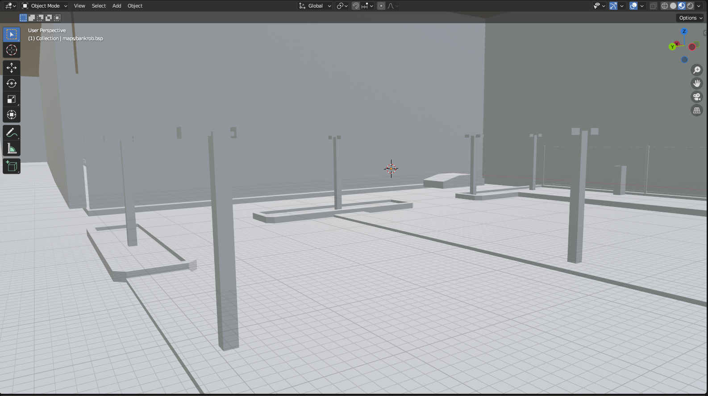
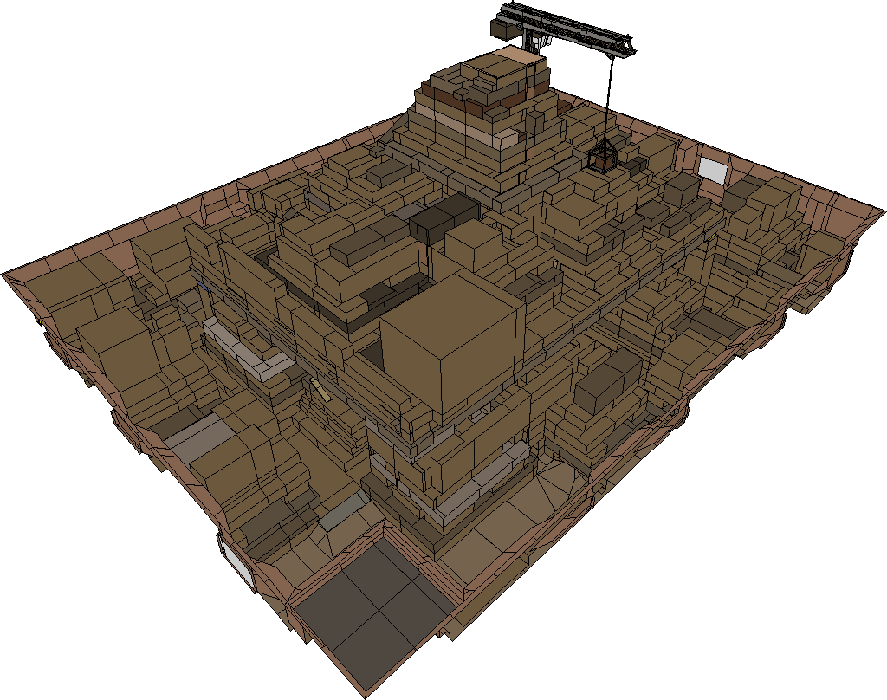
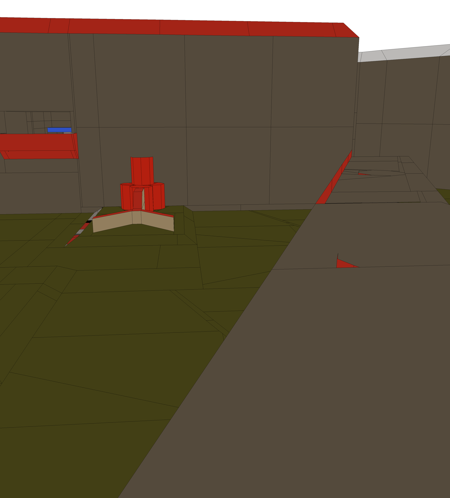
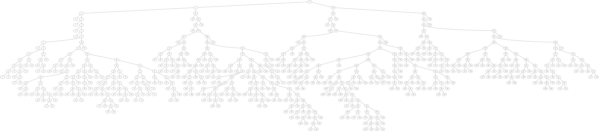

# BSP-Hacking
Written for Python3.8

Multiple algorithms around loading and modifying 
Quake 2 BSP Files

1. [Blender BSP Importer](#blender-bsp-importer)
2. [Q2BSP class](#q2bsp-class)
3. [Custom Software Renderer](#custom-software-renderer)
4. [Modifying BSP files](#modifying-bsp-files)
5. [Additional ideas](#additional-ideas)

## Q2BSP class
The Q2BSP class is still incomplete but built in a way that allows
easily extending it. Purpose of this class is to load all the information
required for the projects described here. 
For every lump that can be loaded and that does not need
a compiler for exporting, the class also contains 
methods for saving it in a valid Quake 2 BSP file.

For information on the Quake 2 BSP file format, see [Quake 2 BSP File Format
by Max McGuire (07 June 2000)](https://www.flipcode.com/archives/Quake_2_BSP_File_Format.shtml).

## [Blender BSP Importer](docs/blender_importer.md)

The current version was built for mesh-only import to blender, solidification
and export as STL for 3D printing.

## [Custom software renderer](docs/renderer.md)

The original goal of this sub-project was writing
a simple renderer for radar images (top-down views
of a map that allows seeing all paths where a player can
walk on a map). After achieving this, the project was
extended to a renderer featuring custom z-buffering and orthographic and
 perspective projection as well as
rotation, translation and scaling transformations.

It builds on the Python Image Library (PIL) that allows
drawing colored polygons on an image and does not allow
real-time rendering.

## [Modifying BSP Files](docs/modifying.md)

Intention of this sub-project was finding various ways of editing BSP files that
don't require recompiling them. This includes surface specific flags like transparency,
volume specific contents and modifying textures and lightmaps.

## Additional ideas
There are numerous ways to extending this project. Some of them are:

- Porting the renderer to a real-time 3D renderer like Panda3D. While this software renderer was a learning project
mostly around transformations and projections, a hardware renderer would allow more complex calculations like lighting
in real-time.

- Analyzing how BSP compilers structure data. This is especially interesting in the context of binary space partitioning
and visibility determination. As an example, the BSP tree for a rather simple map looks like this:
