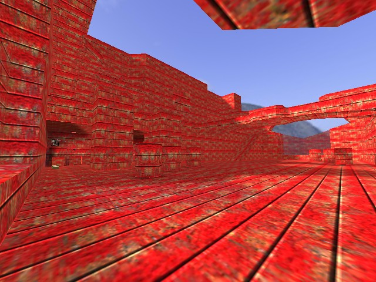
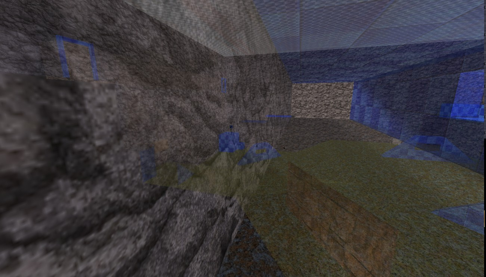
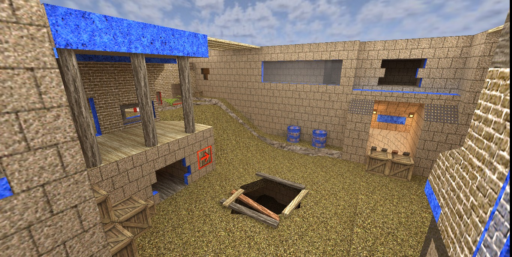
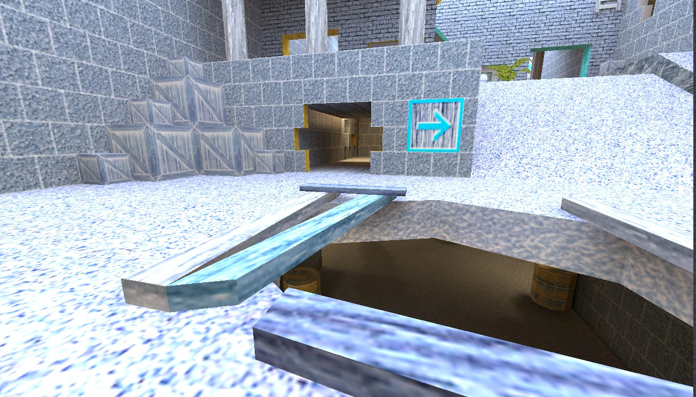
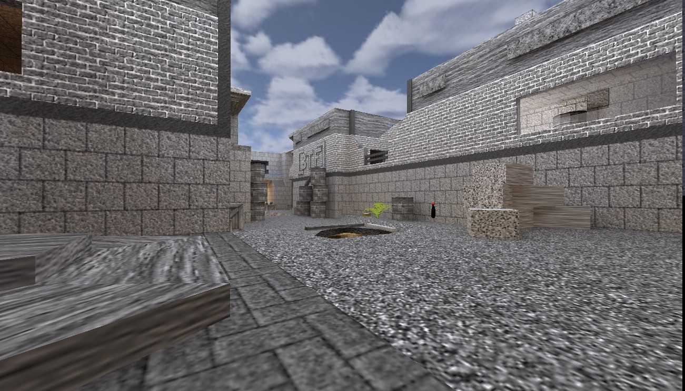
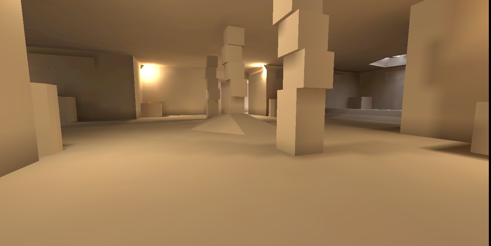
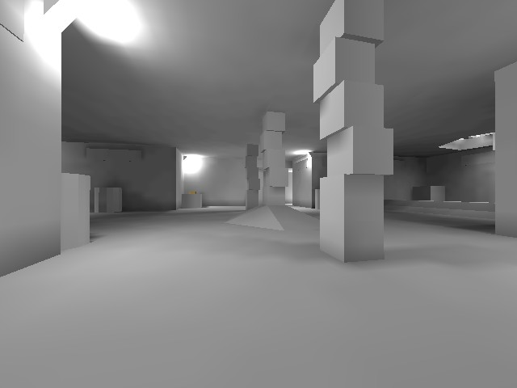

# Modifying BSP Files
There are various ways of modifying bsp files after they were compiled using functions
included in this project. These are for example
- assigning the same texture to each face
- setting the same surface flag for each face
- modifying all textures loaded by a map
- editing the lightmaps

## Assigning the same texture to each face
This task is pretty simple. You load a Q2BSP object, change all texture names and
save it to a new location:
```python
from Q2BSP import *
temp_map = Q2BSP(map_path)
for idx, tex_info in enumerate(temp_map.tex_infos):
    temp_map.tex_infos[idx].set_texture_name(new_texture_name)
temp_map.update_lump_sizes()
temp_map.save_map(new_location)
```



## Setting the same surface flag for each face
Surface and contents flags are stored as dataclass objects in the Q2BSP class.
To set for example trans33 for transparency, run the following code:

```python
from Q2BSP import *
temp_map = Q2BSP(map_path)
for idx, tex_info in enumerate(temp_map.tex_infos):
    temp_map.tex_infos[idx].flags.trans33 = True
temp_map.update_lump_sizes()
temp_map.save_map(new_location)
```



## Modifying all textures loaded by a map
This project contains functions for modifying BSP files to load
- monochrome textures
- inverted textures
- grayscale textures
- a white texture

Reference image of unchanged map:


### Monochrome textures
This subproject copies all textures loaded by a specified BSP file and rescales
them to a size of 1×1 pixels. Run `create_monochrome_textures(pball_path, "/maps/wipa.bsp", "twscripts/", "uni")`


### Inverted textures
These textures are inverted using a PIL built-in function. 
Code: `create_inverted_textures(pball_path, "/maps/wipa.bsp", "twscripts/", "inv")`



### Grayscale textures
Converting textures to grayscale also uses a PIL function. This is much faster
than manually editing each pixel.
Code: `create_grayscale_textures(pball_path, "/maps/wipa.bsp", "twscripts/", "gs")`



### Only white textures
Replacing all texture links by one to a white texture is a good way to inspect
the map's lightmaps. These are Quake 2's variant of precalculated static lighting and are multiplied
with the texels to yield surface colors.
Code: `bsp_lightmap_only(pball_path, "/maps/wipa.bsp", "twscripts/", "white")`



## Modifying lightmaps
Last but not least, the lightmaps itself can also be changed. One of the easiest
modifications - next to simply removing the lightmap - is converting it to grayscale.
For doing so, the formula intensity = 0.2989*color.r + 0.5870*color.g + 0.1140*color.b
is used. There are, however, also a few different equations around.
Code: `make_lightmap_grayscale(pball_path+"/maps/wipa_white", "gsl")`

