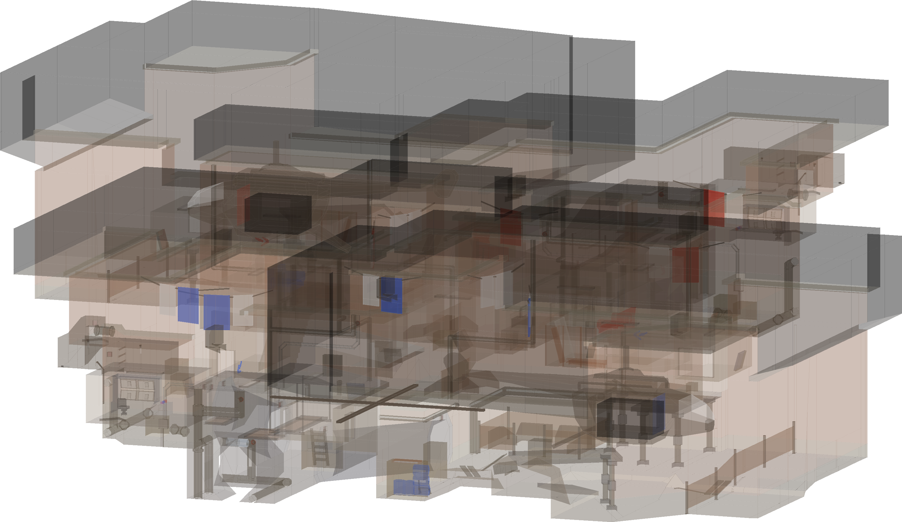
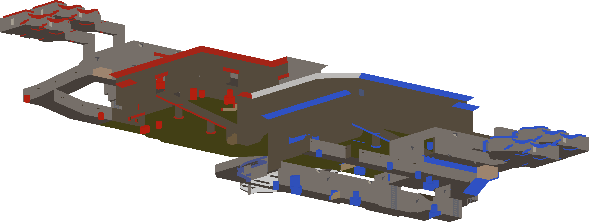
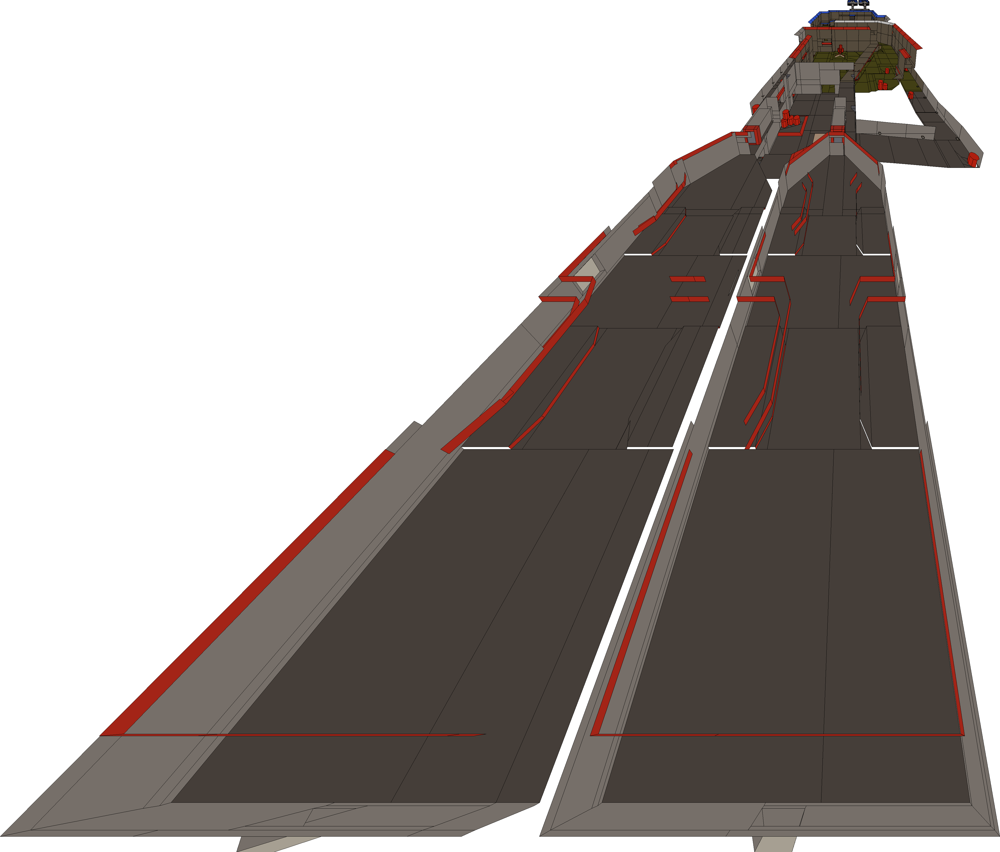
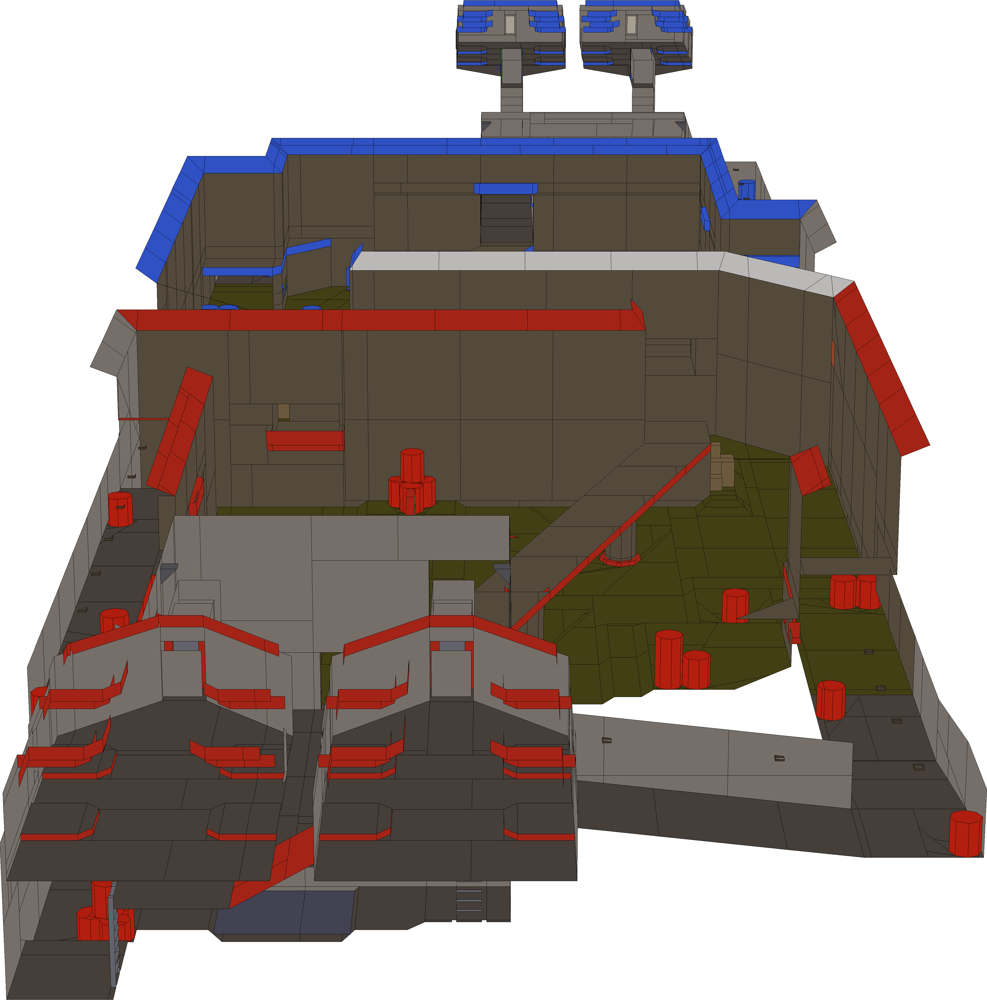

# BSP Software Renderer
This project evolved in five major steps which are conserved as
rendering modes in the code. 

## 1. Wireframe rendering
This mode renders edges instead of faces and thus contains zero depth
information by itself. To add a sense of depth, a heatmap-like color
scale is used.

To render the image above, run `create_image(pball_path, "/maps/siegecastle.bsp", "all", 3, "mode3.png", max_resolution=1024, x_an=0.0, y_an=0.0, z_an=0.0)
`

## 2-3. Semi-transparent face rendering

In contrast to 1. this mode renders faces and not edges. Because it
is lacking z-buffering, faces are transparent and once again
don't offer depth information. To counter it, faces are rendered
with the same heatmap-like coloring as above. As an alternative,
faces can also be rendered with their true color:

Code: `create_image(pball_path, "/maps/wobluda_fix.bsp", "all", 2, "mode2.png", max_resolution=1024, x_an=0.0, y_an=0.0, z_an=0.0)`

## 4. Colored orthographic projection rendering

In this step, a custom z-buffering method was added that causes faces to be rendered from back
to front. This causes faces closer to the camera being drawn on top of more distant ones.

Code: `create_image(pball_path, "/maps/nhb.bsp", "all", 1, "mode1.png", max_resolution=1024, x_an=0.0, y_an=0.0, z_an=0.0)`

## 5. Perspective projection

This projection resembles human vision and causes closer objects to be rendered larger than more distant ones of same size.
. The higher the specified field of view (FOV) the stronger this effect gets

whereas low FOVs get similar to orthographic projection:

This renderer moves maps closer to or further away from the camera to always
fill the whole image.

Code: `create_image(pball_path, "/maps/splatmesa.bsp", "all", 0, "mode0.png", max_resolution=1024, x_an=0.0, y_an=0.0, z_an=0.0)`
